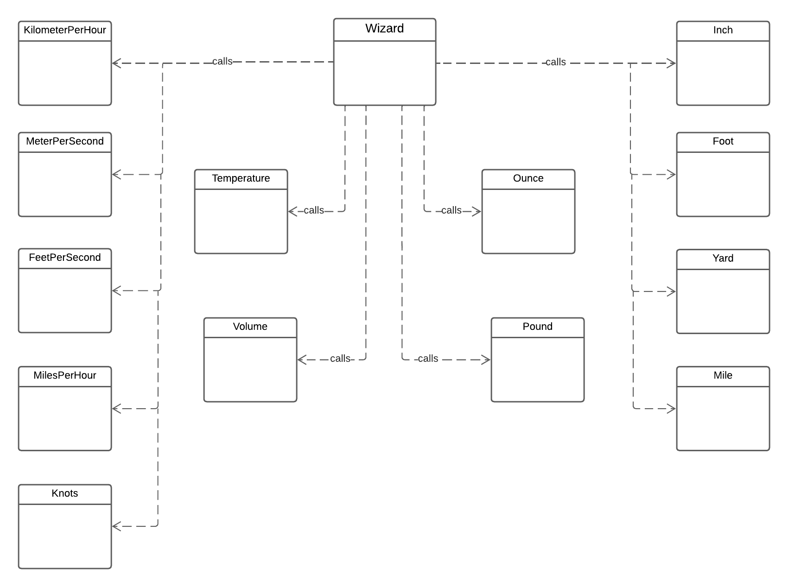
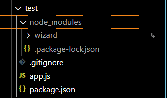
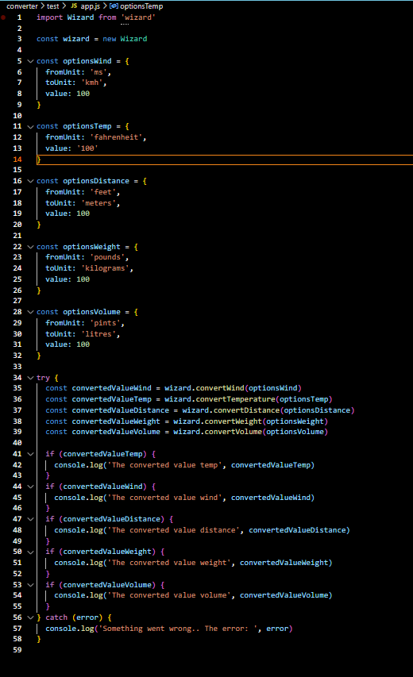

# Mall för inlämning laboration 1, 1dv610
​
## Checklista
  - [x] Jag har skrivit all kod och reflektioner själv. Jag har inte använt mig av andras kod för att lösa uppgiften.
  - [x] Mina testresultat är skrivna utifrån utförd testning ( och inte teoretiskt: "det bör fungera" :) )
  - [x] Koden är objektorienterad
  - [x] Jag har skrivit en modul som riktar sig till programmerare
​
## Egenskattning och mål
  - [ ] Jag är inte klar eftersom jag vet att jag saknar något. (Då skall du inte lämna in! Lämna då istället in på restlaboration.)
  - [x] Jag eftersträvar med denna inlämning godkänt betyg (E-D)
    - [x] De flesta testfall fungerar
    - [x] Koden är förberedd på Återanvändning
    - [x] All kod samt historik finns i git 
    - [x] Kodkvaliterskraven är ifyllda
    - [x] Reflektion är skriven utifrån bokens kapitel 
  - [ ] Jag eftersträvar med denna inlämning högre betyg (C-B) och anser mig uppfylla alla extra krav för detta. 
    - [ ] Samtliga testfall är skrivna    
    - [ ] Testfall är automatiserade
    - [x] Det finns en tydlig beskrivning i hur modulen skall användas (i git)
    - [ ] Kodkvalitetskraven är varierade 
  - [ ] Jag eftersträvar med denna inlämning högsta betyg (A) 
​
Förtydligande: Examinator kommer sätta betyg oberoende på vad ni anser. 
​
## Återanvändning
Instructions on how to use my package is available at: 
* https://www.npmjs.com/package/@violacaroline/wizard
* https://github.com/AndreaViolaCaroline/1dv610-assignment-L1/blob/main/converter/README.md
​
## Beskrivning av min kod

The package "wizard" can convert back and forth between the wind speed units kmh, m/s, ft/s, mph and knots, the temperature units fahrenheit, celsius, do certain conversions from common US distance units to certain metric units, convert ounces and pounds to grams/kilograms and convert pints and gallons to litres.

The wizard class is at the highest level of abstraction and uses all the other class for doing its calculations from the specific units specified by the options.

​
## Hur jag testat

I created a test folder where I ran npm init and basically had a seperate javascript project. I found a command 'npm link' that was new to me (indepth info at https://docs.npmjs.com/cli/v8/commands/npm-link). Essentially, it lets you test your package without hosting it on npm first thing. Creating a symbolic link between projects in your global node modules folder on your computer, making it easier to develop and lets you reference your package locally! (This part will however be removed upon publishing the package on NPM)

Inside that test folder I created a simple app.js file and simulated the wizard being used, changing the options object and validating the calculations manually as well as trying to "ruin" the functionality by providing wrong/missing arguments.

Screen shots from the testing environment:

or

​
## Testfall

The tests covers all units, unit per unit (see tables below) making sure all algorithms are correct.

### Test results wind conversion

All units/classes converts from the value 100, i.e. Class KilometerPerHour expected/actual value is based on 100kmh being converted etc.

#### Providing faulty arguments

| Error  | Expected output | Actual output | Fixes |
| ----------- | :----: | :----: | :----: |
| Missing options object | You have to specify an options object, see README | You have to specify an options object, see README | |
| Missing fromUnit | 'The unit is empty' | 'The unit is empty' | |
| Invalid fromUnit | 'The unit is not a valid unit (kmh, ms, fts, mph, knots)' | The unit is not a valid unit (kmh, ms, fts, mph, knots)' | |
| Missing toUnit | 'The unit is empty' | 'The unit is empty' | |
| Invalid toUnit | The unit is not a valid unit (kmh, ms, fts, mph, knots)' | The unit is not a valid unit (kmh, ms, fts, mph, knots)' | |
| Missing value | 'The value is empty' | 'The input is empty' | Changed input to value |
| Invalid value | 'The value is not a number' | 'The value is not a number' | |
| Value is not positive | Number must be positive | Number must be positive | |

#### Class KilometerPerHour

| Methodname  | Expected value | Actual value |
| ----------- | :----: | :----: |
|convertToMeterPerSecond | 27.8 | 27.8 |
|convertToFeetPerSecond  | 91.1 | 91.1 |
|convertToMilesPerHour   | 62.1 | 62.1 |
|convertToKnots          | 54   | 54   |

#### Class MeterPerSecond

| Methodname  | Expected value | Actual value |
| ----------- | :----: | :----: |
|convertToKilometerPerHour | 360   | 360   |
|convertToFeetPerSecond    | 328.1 | 328.1 |
|convertToMilesPerHour     | 223.7 | 223.7 |
|convertToKnots            | 194.4 | 194.4 |

#### Class FeetPerSecond

| Methodname  | Expected value | Actual value |
| ----------- | :----: | :----: |
|convertToKilometerPerHour | 109.7 | 109.7 |
|convertToMeterPerSecond   | 30.5  | 30.5  |
|convertToMilesPerHour     | 68.2  | 68.2 |
|convertToKnots            | 59.2  | 59.2  |

#### Class MilesPerHour

| Methodname  | Expected value | Actual value |
| ----------- | :----: | :----: |
|convertToKilometerPerHour | 160.9 | 160.9 |
|convertToMeterPerSecond   | 44.7  | 44.7  |
|convertToFeetPerSecond    | 146.7 | 146.7 |
|convertToKnots            | 86.9  | 86.9  |

#### Class Knots

| Methodname  | Expected value | Actual value |
| ----------- | :----: | :----: |
|convertToKilometerPerHour | 185.3 | 185.2 |
|convertToMeterPerSecond   | 51.4  | 51.4  |
|convertToFeetPerSecond    | 168.8 | 168.8 |
|convertToMilesPerHour     | 115.1 | 115.1 |

#### **Summary Wind Conversion**

All methods have calculated correctly. Only knots to kmh shows a slight difference in the precision (185.3 vs. 185.2) when I look closer on the algorithm of my reference it appears to be the same as mine. However, I consider the difference to be accepted.

### Test results temperature conversion

All units/classes converts from the value 100, i.e. Class Temperature expected/actual value is based on 100 fahrenheit OR celsius being converted etc.

#### Providing faulty arguments

| Error  | Expected output | Actual output | Fixes |
| ----------- | :----: | :----: | :----: |
| Missing options object | You have to specify an options object, see README | You have to specify an options object, see README | |
| Missing from | 'The unit is empty' | 'The unit is empty' | |
| Invalid from | 'The unit is not a valid unit (celsius/fahrenheit)' | 'The unit is not a valid unit (celsius/fahrenheit)' | |
| Missing value | 'The value is empty' | 'The value is empty' | |
| Invalid value | 'The value is not a number' | 'The value is not a number' | |

#### Class Temperature

| Methodname  | Expected value | Actual value |
| ----------- | :----: | :----: |
|convertFromFahrenheit | 37.8 | 37.8 |
|convertFromCelsius   | 212  | 212 |

#### **Summary Temperature Conversion**

All methods have calculated correctly.

### Test results distance conversion

All units/classes converts from the value 100, i.e. Class Inch expected/actual value is based on 100 inches being converted etc.

#### Providing faulty arguments

| Error  | Expected output | Actual output | Fixes |
| ----------- | :----: | :----: | :----: |
| Missing options object | You have to specify an options object, see README | You have to specify an options object, see README | |
| Missing fromUnit | 'The unit is empty' | 'The unit is empty' | |
| Invalid fromUnit | 'The unit is not a valid unit (inches, feet, yards, miles)' | 'The unit is not a valid unit (inches, feet, yards, miles)' | |
| Missing toUnit | 'The unit is empty' | 'The unit is empty' | |
| Invalid toUnit | The unit is not a valid unit (centimeters, meters / meters, kilometers)' | The unit is not a valid unit (centimeters, meters / meters, kilometers)' | |
| Missing value | 'The value is empty' | 'The value is empty' | |
| Invalid value | 'The value is not a number' | 'The value is not a number' | |
| Value is not positive | Number must be positive | Number must be positive | |

#### Class Inch

| Methodname  | Expected value | Actual value |
| ----------- | :----: | :----: |
|convertToCentimeters | 254 | 254 |
|convertToMeters   | 2.54  | 2.5 |

#### Class Foot

| Methodname  | Expected value | Actual value |
| ----------- | :----: | :----: |
|convertToCentimeters | 30.5 | 30.5 |
|convertToMeters   | 3048  | 3048 |

#### Class Yard

| Methodname  | Expected value | Actual value |
| ----------- | :----: | :----: |
|convertToMeters | 91.4 | 91.4 |
|convertToKilometers   | 0.09  | 0.1 |

#### Class Mile

| Methodname  | Expected value | Actual value |
| ----------- | :----: | :----: |
|convertToMeters | 160.9 | 160.9 |
|convertToKilometers   | 160934 | 160934.4 |

#### **Summary Distance Conversion**

All methods have calculated correctly. Only yards to kilometers shows a slight difference in the precision (0.09 vs. 0.1), this due to me controlling the return value to one decimal only. However, I consider the difference to be accepted.

### Test results weight conversion

All units/classes converts from the value 100, i.e. Class Pound expected/actual value is based on 100 pounds being converted etc.

#### Providing faulty arguments

| Error  | Expected output | Actual output |
| ----------- | :----: | :----: |
| Missing options object | You have to specify an options object, see README | You have to specify an options object, see README | 
| Missing fromUnit | 'The unit is empty' | 'The unit is empty' | 
| Invalid fromUnit | 'The unit is not a valid unit (ounces, pounds)' | The unit is not a valid unit (ounces, pounds)' | 
| Missing toUnit | 'The unit is empty' | 'The unit is empty' | 
| Invalid toUnit | The unit is not a valid unit (grams, kilograms)' | The unit is not a valid unit (grams, kilograms)' | 
| Missing value | 'The value is empty' | 'The value is empty' |  
| Invalid value | 'The value is not a number' | 'The value is not a number' | 
| Value is not positive | Number must be positive | Number must be positive | 

#### Class Ounce

| Methodname  | Expected value | Actual value |
| ----------- | :----: | :----: |
|convertToGrams | 2835 | 2835 |
|convertToKilograms   | 2.8 | 2.8 |

#### Class Pound

| Methodname  | Expected value | Actual value |
| ----------- | :----: | :----: |
|convertToGrams | 45359.2 | 45359.2 |
|convertToKilograms   | 45.4 | 45.4 |

#### **Summary Weight Conversion**

All methods have calculated correctly. Faulty arguments has returned specific feedback.

### Test results volume conversion

All units/classes converts from the value 100, i.e. Class KilometerPerHour expected/actual value is based on 100kmh being converted etc.

#### Providing faulty arguments

| Error  | Expected output | Actual output |
| ----------- | :----: | :----: |
| Missing options object | You have to specify an options object, see README | You have to specify an options object, see README | 
| Missing fromUnit | 'The unit is empty' | 'The unit is empty' | 
| Invalid fromUnit | 'The unit is not a valid unit (pints, gallons)' | The unit is not a valid unit (pints, gallons)' |  
| Missing value | 'The value is empty' | 'The value is empty' |  
| Invalid value | 'The value is not a number' | 'The value is not a number' | 
| Value is not positive | Number must be positive | Number must be positive |

#### Class Volume

| Methodname  | Expected value | Actual value |
| ----------- | :----: | :----: |
|convertPintsToLitres | 47.3 | 47.3 |
|convertGallonsToLitres   | 378.5 | 378.5 |

### **Summary Volume Conversion**

All methods have calculated correctly. Faulty arguments has returned specific feedback.
​
​
## Kodkvalitetskrav
​
### Namngivning
​
| Class/Method name & explanation | Reflection & rules from Clean Code |
| ----------- | ----------- |
|  Wizard - The class being exported that contains the methods for converting units | - **"Don't be cute"**, Wizard sure to many people might mean that something is being magically transformed to something else, well, this is not magic. A word like converter would be more suitable |
|  volume - method converting certain volume units | **"A long descriptive name is better than an enigmatic, short name"** - I could think of a few ways to interpret volume, is it volume as in loud/quiet, is it volume as in 3-dimensional measure (then, is it dry or fluid?) or is it volume as in vol.1 in a series? - Adding fluid onto this methodname would make it clearer and definitely not too long. |
|  wind - method converting certain wind units  | **"Use intention revealing names"** - wind does not really imply what this function does more than that it probably has got something to do with wind. Adding convert onto the name, i.e convertWind, would 1. make the method name a verb - as is recommended in the literature and 2. say exactly what the method does - it converts wind. |
|  temperature - method converting certain temperature units  |  **"Pick one word per concept!"** - So, if I changed the above method name to convertWind, then convert in front of all methods that convert something would make it more uniform and showing a clear concept, this package has a bunch of methods that converts stuff! |
|  weight - method converting certain weight units |   **"Use solution domain names"** - Programmers will be using this package and it is suitable and welcomed to use solution domain names, like computer science terms and algorithm names to avoid unnecessary bothering of a customer when the programmer is not familiar with the problem domain and its terms - however - when there is not really a translation to a CS term, I'm using the problem domain name. Here weight, since it's one of the units that is handled, in fact, it even makes sense in this particular case: **"code that has more to do with problem domain concepts should have problem domain names"** - the weight function has to do with the concept of converting weight units which I would describe as a problem domain concept. |

​
### Funktioner
​
| Method | Amount rows | Reflection & rules from Clean Code |
| ----------- | ----------- | ----------- |
|  wind  |  90  |  **"Methods should be very small and then they should be smaller than that"** - this one is quite large.. it also confirms what the book states about switch statements - "always larger than a method should be", they can not always be avoided though, but should perhaps be hidden in a more low level class since this function and Wizard is the highest in my package (somehow, a whole restructure of package might be in order to achieve this, but it is beyond my knowledge). |
|  distance  |  67  |  **"Methods should be doing one thing"** - again the switch statement comes in and creates caos - a switch statement more or less implys that more than one thing COULD be done through this function, also, "Error handling is ONE thing" - I'm using try/catch blocks in here too, mixing error processing with normal processing, which could benefit from being extracted - as in a seperate function with a try/catch block where I call the distance function. The options argument is good in the sense of avoiding several arguments and attach all of them to a concept (object), but since Im writing in javascript it would be good to clarify in the comments that its an object - which I did not have at first. |
|  weight  |  44   |  Common Monadic Form - **"There are two very common reasons why to pass an argument to a function, either you are asking a question about it, or you are transforming it into something else"** - It should be avoided to have it do both because it leads to confusion (Command Query Separation) - I would argue that I am keeping this intact by transforming the argument into something else and then returning it, but there should also be a clear distinction in the name, which there is not - am I asking a question about weight or am I changing weight? As I mentioned adding convert onto the method name would make it a verb in the other reflection section, also here adding convert could be clarifying since it implys that I am "changing" weight - rather than asking a question about it.  |
|  validatePositiveNumber  |  8  | **"Use descriptive names, what does the function do?"** - This name is a little bit obscure, is it validating only positive numbers? Or does it ensure that it is a positive number? Possibly, changing the name to confirmPositiveNumber would aid, but it would also change the "one word per concept idea" in this case, since validate is used for the others.  |
|  isNotNumber  |  3   | **"Step down rule"** - This regards more where the method is located in the class than the method itself (sidenote: although I did have to think because I wanted to name it isNumber to follow my other naming and have it return true if indeed it was a number, but the built in function isNaN returns true if it is NOT a number, hence.. hehe) - "code should be read top to bottom, we want every function to be followed by those at the next level of abstraction" - I had totally been thinking the opposite before reading this! It makes total sense, but I think my brain was thinking that it should be organized more as a CV - with the latest/more relevant/interesting information at the top, therefor this method, which is really low level should have been placed at the top of the file instead. |
​
## Laborationsreflektion
Reflektera över uppgiften utifrån ett kodkvalitetsperspektiv. Använd begrepp ifrån boken.

I am living in Mexico and this little library was inspired by a real life event amongst travellers when a hurricane was rolling in. There was a need for conversion between the wind speed units that was used by different countries to fully understand what kind of winds were to be expected. This library makes it easy to create an application that converts some of the most common units, not only regarding wind, but mainly between metric and US customary units.