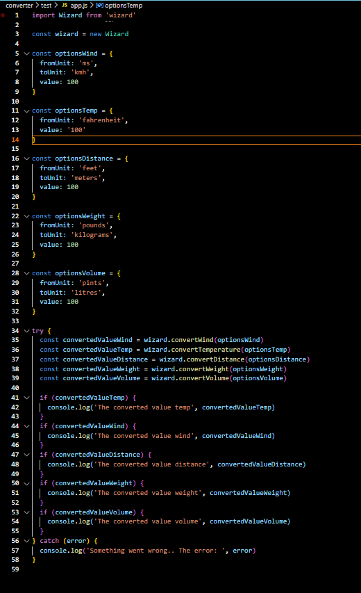

# Test report

## What is being tested?

The package "wizard" can convert back and forth between the wind speed units kmh, m/s, ft/s, mph and knots, the temperature units fahrenheit, celsius, do certain conversions from common US distance units to certain metric units, convert ounces and pounds to grams/kilograms and convert pints and gallons to litres. 

The tests covers all units, unit per unit (see tables below) making sure all algorithms are correct.

## How is it being tested?

I created a test folder where I ran npm init and basically had a seperate javascript project. I found a command 'npm link' that was new to me (indepth info at https://docs.npmjs.com/cli/v8/commands/npm-link). Essentially, it lets you test your package without hosting it on npm first thing. Creating a symbolic link between projects in your global node modules folder on your computer, making it easier to develop and lets you reference your package locally! (This part will however be removed upon publishing the package on NPM)

Inside that test folder I created a simple app.js file and simulated the wizard being used, changing the options object and validating the calculations manually as well as trying to "ruin" the functionality by providing wrong/missing arguments.

Screen shots from the testing environment:




Example wind conversion:

```
import  Wizard  from 'wizard'

const wizard = new Wizard

const options = {
  fromUnit: 'kmh',
  toUnit: 'mph',
  value: 100
}

const convertedValue = wizard.convertWind(options)

console.log('The converted value', convertedValue)

```

Example temerature conversion:

```
import  Wizard  from 'wizard'

const wizard = new Wizard

const options = {
  fromUnit: 'celsius',
  value: 100
}

const convertedValue = wizard.convertTemperature(options)

console.log('The converted value', convertedValue)

```

## Test results wind conversion

All units/classes converts from the value 100, i.e. Class KilometerPerHour expected/actual value is based on 100kmh being converted etc.

### Providing faulty arguments

| Error  | Expected output | Actual output | Fixes |
| ----------- | :----: | :----: | :----: |
| Missing options object | You have to specify an options object, see README | You have to specify an options object, see README | |
| Missing fromUnit | 'The unit is empty' | 'The unit is empty' | |
| Invalid fromUnit | 'The unit is not a valid unit (kmh, ms, fts, mph, knots)' | The unit is not a valid unit (kmh, ms, fts, mph, knots)' | |
| Missing toUnit | 'The unit is empty' | 'The unit is empty' | |
| Invalid toUnit | The unit is not a valid unit (kmh, ms, fts, mph, knots)' | The unit is not a valid unit (kmh, ms, fts, mph, knots)' | |
| Missing value | 'The value is empty' | 'The input is empty' | Changed input to value |
| Invalid value | 'The value is not a number' | 'The value is not a number' | |
| Value is not positive | Number must be positive | Number must be positive | |


### Class KilometerPerHour

| Methodname  | Expected value | Actual value |
| ----------- | :----: | :----: |
|convertToMeterPerSecond | 27.8 | 27.8 |
|convertToFeetPerSecond  | 91.1 | 91.1 |
|convertToMilesPerHour   | 62.1 | 62.1 |
|convertToKnots          | 54   | 54   |

### Class MeterPerSecond

| Methodname  | Expected value | Actual value |
| ----------- | :----: | :----: |
|convertToKilometerPerHour | 360   | 360   |
|convertToFeetPerSecond    | 328.1 | 328.1 |
|convertToMilesPerHour     | 223.7 | 223.7 |
|convertToKnots            | 194.4 | 194.4 |

### Class FeetPerSecond

| Methodname  | Expected value | Actual value |
| ----------- | :----: | :----: |
|convertToKilometerPerHour | 109.7 | 109.7 |
|convertToMeterPerSecond   | 30.5  | 30.5  |
|convertToMilesPerHour     | 68.2  | 68.2 |
|convertToKnots            | 59.2  | 59.2  |

### Class MilesPerHour

| Methodname  | Expected value | Actual value |
| ----------- | :----: | :----: |
|convertToKilometerPerHour | 160.9 | 160.9 |
|convertToMeterPerSecond   | 44.7  | 44.7  |
|convertToFeetPerSecond    | 146.7 | 146.7 |
|convertToKnots            | 86.9  | 86.9  |

### Class Knots

| Methodname  | Expected value | Actual value |
| ----------- | :----: | :----: |
|convertToKilometerPerHour | 185.3 | 185.2 |
|convertToMeterPerSecond   | 51.4  | 51.4  |
|convertToFeetPerSecond    | 168.8 | 168.8 |
|convertToMilesPerHour     | 115.1 | 115.1 |

## Summary Wind Conversion

All methods have calculated correctly. Only knots to kmh shows a slight difference in the precision (185.3 vs. 185.2) when I look closer on the algorithm of my reference it appears to be the same as mine. However, I consider the difference to be accepted.

## Test results temperature conversion

All units/classes converts from the value 100, i.e. Class Temperature expected/actual value is based on 100 fahrenheit OR celsius being converted etc.

### Providing faulty arguments

| Error  | Expected output | Actual output | Fixes |
| ----------- | :----: | :----: | :----: |
| Missing options object | You have to specify an options object, see README | You have to specify an options object, see README | |
| Missing from | 'The unit is empty' | 'The unit is empty' | |
| Invalid from | 'The unit is not a valid unit (celsius/fahrenheit)' | 'The unit is not a valid unit (celsius/fahrenheit)' | |
| Missing value | 'The value is empty' | 'The value is empty' | |
| Invalid value | 'The value is not a number' | 'The value is not a number' | |

### Class Temperature

| Methodname  | Expected value | Actual value |
| ----------- | :----: | :----: |
|convertFromFahrenheit | 37.8 | 37.8 |
|convertFromCelsius   | 212  | 212 |

## Summary Temperature Conversion

All methods have calculated correctly.

## Test results distance conversion

All units/classes converts from the value 100, i.e. Class Inch expected/actual value is based on 100 inches being converted etc.

### Providing faulty arguments

| Error  | Expected output | Actual output | Fixes |
| ----------- | :----: | :----: | :----: |
| Missing options object | You have to specify an options object, see README | You have to specify an options object, see README | |
| Missing fromUnit | 'The unit is empty' | 'The unit is empty' | |
| Invalid fromUnit | 'The unit is not a valid unit (inches, feet, yards, miles)' | 'The unit is not a valid unit (inches, feet, yards, miles)' | |
| Missing toUnit | 'The unit is empty' | 'The unit is empty' | |
| Invalid toUnit | The unit is not a valid unit (centimeters, meters / meters, kilometers)' | The unit is not a valid unit (centimeters, meters / meters, kilometers)' | |
| Missing value | 'The value is empty' | 'The value is empty' | |
| Invalid value | 'The value is not a number' | 'The value is not a number' | |
| Value is not positive | Number must be positive | Number must be positive | |

### Class Inch

| Methodname  | Expected value | Actual value |
| ----------- | :----: | :----: |
|convertToCentimeters | 254 | 254 |
|convertToMeters   | 2.54  | 2.5 |

### Class Foot

| Methodname  | Expected value | Actual value |
| ----------- | :----: | :----: |
|convertToCentimeters | 30.5 | 30.5 |
|convertToMeters   | 3048  | 3048 |

### Class Yard

| Methodname  | Expected value | Actual value |
| ----------- | :----: | :----: |
|convertToMeters | 91.4 | 91.4 |
|convertToKilometers   | 0.09  | 0.1 |

### Class Mile

| Methodname  | Expected value | Actual value |
| ----------- | :----: | :----: |
|convertToMeters | 160.9 | 160.9 |
|convertToKilometers   | 160934 | 160934.4 |

## Summary Distance Conversion

All methods have calculated correctly. Only yards to kilometers shows a slight difference in the precision (0.09 vs. 0.1), this due to me controlling the return value to one decimal only. However, I consider the difference to be accepted.

## Test results weight conversion

All units/classes converts from the value 100, i.e. Class Pound expected/actual value is based on 100 pounds being converted etc.

### Providing faulty arguments

| Error  | Expected output | Actual output |
| ----------- | :----: | :----: |
| Missing options object | You have to specify an options object, see README | You have to specify an options object, see README | 
| Missing fromUnit | 'The unit is empty' | 'The unit is empty' | 
| Invalid fromUnit | 'The unit is not a valid unit (ounces, pounds)' | The unit is not a valid unit (ounces, pounds)' | 
| Missing toUnit | 'The unit is empty' | 'The unit is empty' | 
| Invalid toUnit | The unit is not a valid unit (grams, kilograms)' | The unit is not a valid unit (grams, kilograms)' | 
| Missing value | 'The value is empty' | 'The value is empty' |  
| Invalid value | 'The value is not a number' | 'The value is not a number' | 
| Value is not positive | Number must be positive | Number must be positive | 

### Class Ounce

| Methodname  | Expected value | Actual value |
| ----------- | :----: | :----: |
|convertToGrams | 2835 | 2835 |
|convertToKilograms   | 2.8 | 2.8 |

### Class Pound

| Methodname  | Expected value | Actual value |
| ----------- | :----: | :----: |
|convertToGrams | 45359.2 | 45359.2 |
|convertToKilograms   | 45.4 | 45.4 |

## Summary Weight Conversion

All methods have calculated correctly. Faulty arguments has returned specific feedback.

## Test results volume conversion

All units/classes converts from the value 100, i.e. Class KilometerPerHour expected/actual value is based on 100kmh being converted etc.

### Providing faulty arguments

| Error  | Expected output | Actual output |
| ----------- | :----: | :----: |
| Missing options object | You have to specify an options object, see README | You have to specify an options object, see README | 
| Missing fromUnit | 'The unit is empty' | 'The unit is empty' | 
| Invalid fromUnit | 'The unit is not a valid unit (pints, gallons)' | The unit is not a valid unit (pints, gallons)' |  
| Missing value | 'The value is empty' | 'The value is empty' |  
| Invalid value | 'The value is not a number' | 'The value is not a number' | 
| Value is not positive | Number must be positive | Number must be positive |

### Class Volume

| Methodname  | Expected value | Actual value |
| ----------- | :----: | :----: |
|convertPintsToLitres | 47.3 | 47.3 |
|convertGallonsToLitres   | 378.5 | 378.5 |

## Summary Volume Conversion

All methods have calculated correctly. Faulty arguments has returned specific feedback.